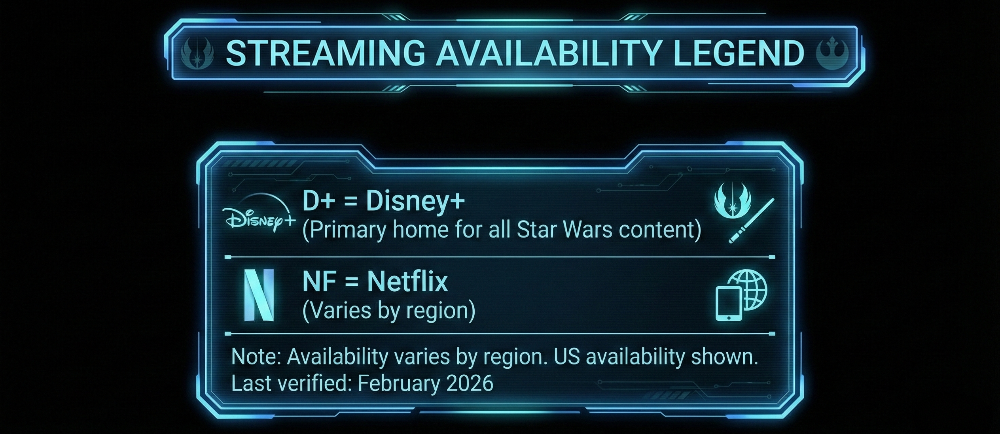

# Comprehensive Star Wars Timeline

## Overview

Star Wars is one of the most beloved and expansive science fiction franchises in history, spanning from 1977 to the present day. This timeline covers all canon films, TV series, and shorts in both **release order** and **in-universe chronological order** using the BBY/ABY calendar system (Before/After the Battle of Yavin).

---

## Part 1: Release Order Timeline

> A comprehensive list of all Star Wars productions organized by their real-world release dates. Use this section to understand the franchise's evolution over time, see when each series aired, and appreciate the cultural context of production eras. Unlike Part 2's chronological watch order, this reflects how audiences originally experienced Star Wars.

### Television Series

| Series | Years Aired | Seasons | Episodes |
|--------|-------------|---------|----------|
| Star Wars: Clone Wars (2003 micro-series) | 2003–2005 | 3 | 25 |
| Star Wars: The Clone Wars | 2008–2020 | 7 | 133 |
| Star Wars: Rebels | 2014–2018 | 4 | 75 |
| Star Wars: Forces of Destiny | 2017–2018 | 2 | 32 |
| Star Wars: Resistance | 2018–2020 | 2 | 40 |
| The Mandalorian | 2019–present | 3 | 24 |
| Star Wars: The Bad Batch | 2021–2024 | 3 | 47 |
| Star Wars: Visions | 2021–2023 | 2 | 18 |
| The Book of Boba Fett | 2021–2022 | 1 | 7 |
| Obi-Wan Kenobi | 2022 | 1 | 6 |
| Andor | 2022–2024 | 2 | 24 |
| Tales of the Jedi | 2022–2023 | 2 | 15 |
| Ahsoka | 2023–present | 1 | 8 |
| Star Wars: Young Jedi Adventures | 2023–present | 2 | 50 |
| The Acolyte | 2024 | 1 | 8 |
| Skeleton Crew | 2024–2025 | 1 | 8 |
| Tales of the Empire | 2024 | 1 | 6 |

### 2026 & Upcoming Productions

| Series/Film | Status | Expected Release | Notes |
|-------------|--------|------------------|-------|
| The Mandalorian & Grogu | Theatrical Film | 2026 | First Disney-era theatrical release |
| The Mandalorian Season 4 | In Development | 2026/2027 | Continuation of Din Djarin's story |
| Ahsoka Season 2 | In Production | 2026 | Continuing the search for Ezra |
| Andor Season 2 | Completed | 2025 | Final season leading to Rogue One |
| Lando | In Development | TBD | Limited series following Lando Calrissian |
| Star Wars: Skeleton Crew Season 2 | Rumored | TBD | Potential continuation |
| Dave Filoni's Crossover Film | In Development | 2027+ | "Mandoverse" culmination event |

### Films

#### The Skywalker Saga

##### Prequel Trilogy
| # | Title | Year | Era (BBY/ABY) |
|---|-------|------|---------------|
| I | Star Wars: Episode I – The Phantom Menace | 1999 | 32 BBY |
| II | Star Wars: Episode II – Attack of the Clones | 2002 | 22 BBY |
| III | Star Wars: Episode III – Revenge of the Sith | 2005 | 19 BBY |

##### Original Trilogy
| # | Title | Year | Era (BBY/ABY) |
|---|-------|------|---------------|
| IV | Star Wars: Episode IV – A New Hope | 1977 | 0 BBY/ABY |
| V | Star Wars: Episode V – The Empire Strikes Back | 1980 | 3 ABY |
| VI | Star Wars: Episode VI – Return of the Jedi | 1983 | 4 ABY |

##### Sequel Trilogy
| # | Title | Year | Era (BBY/ABY) |
|---|-------|------|---------------|
| VII | Star Wars: Episode VII – The Force Awakens | 2015 | 34 ABY |
| VIII | Star Wars: Episode VIII – The Last Jedi | 2017 | 34 ABY |
| IX | Star Wars: Episode IX – The Rise of Skywalker | 2019 | 35 ABY |

#### A Star Wars Story (Anthology Films)
| # | Title | Year | Era (BBY/ABY) |
|---|-------|------|---------------|
| 1 | Rogue One: A Star Wars Story | 2016 | 0 BBY |
| 2 | Solo: A Star Wars Story | 2018 | 10 BBY |

#### Animated Feature Films
| # | Title | Year | Era (BBY/ABY) |
|---|-------|------|---------------|
| 1 | Star Wars: The Clone Wars (Film) | 2008 | 22 BBY |

### Shorts & Specials

| Title | Year | Episodes/Runtime | Type |
|-------|------|------------------|------|
| Star Wars: Forces of Destiny | 2017–2018 | 32 shorts | Animated micro-series |
| Star Wars Galaxy of Adventures | 2018–2020 | 32 shorts | Animated educational |
| LEGO Star Wars Holiday Special | 2020 | 44 min | Animated special |
| LEGO Star Wars: Terrifying Tales | 2021 | 46 min | Animated special |
| LEGO Star Wars: Summer Vacation | 2022 | 45 min | Animated special |

---

## Part 2: Complete Chronological Watch Order

> The definitive episode-by-episode and film-by-film watch order arranged by in-universe year (BBY/ABY). Every major production is numbered sequentially, making this ideal for viewers who want to experience the Star Wars universe in the order events actually happened. Unlike Part 1's release order, this follows the fictional timeline.

### Streaming Legend

---

### Era 1: The High Republic (500–100 BBY)

> The golden age of the Jedi Order and the Galactic Republic, centuries before the Skywalker Saga.

| # | Title | Type | Runtime | Stream | Notes |
|---|-------|------|---------|--------|-------|
| 1 | **Star Wars: Young Jedi Adventures** | Series | 50 ep | D+ | ~200 years before Episode I |
| 2 | **The Acolyte** | Series | 8 ep | D+ | 100 years before Episode I |

---

### Era 2: Fall of the Jedi / Clone Wars (32–19 BBY)

> The final decades of the Galactic Republic, the return of the Sith, and the Clone Wars that would reshape the galaxy.

#### The Phantom Menace Era (32 BBY)
| # | Title | Type | Runtime | Stream | Notes |
|---|-------|------|---------|--------|-------|
| 3 | **Episode I – The Phantom Menace** | Film | 136 min | D+ | Discovery of Anakin Skywalker |

#### Between Episodes I & II (32–22 BBY)
| # | Title | Type | Runtime | Stream | Notes |
|---|-------|------|---------|--------|-------|
| 4 | Tales of the Jedi: "Life and Death" | Short | 15 min | D+ | Young Ahsoka (flashback) |
| 5 | Tales of the Jedi: "Justice" | Short | 16 min | D+ | Count Dooku's fall begins |
| 6 | Tales of the Jedi: "Choices" | Short | 13 min | D+ | Dooku leaves the Jedi |
| 7 | Tales of the Jedi: "The Sith Lord" | Short | 14 min | D+ | Dooku joins Sidious |

#### Attack of the Clones Era (22 BBY)
| # | Title | Type | Runtime | Stream | Notes |
|---|-------|------|---------|--------|-------|
| 8 | **Episode II – Attack of the Clones** | Film | 142 min | D+ | Beginning of the Clone Wars |
| 9 | **The Clone Wars (Film)** | Film | 98 min | D+ | Ahsoka Tano introduced |

#### The Clone Wars Series (22–19 BBY)
| # | Title | Type | Runtime | Stream | Notes |
|---|-------|------|---------|--------|-------|
| 10 | The Clone Wars S1–S6 | Series | 121 ep | D+ | Chronological order recommended |
| 11 | Tales of the Jedi: "Practice Makes Perfect" | Short | 11 min | D+ | Ahsoka's training |
| 12 | The Clone Wars S7: "The Bad Batch" arc (E1-4) | Series | 4 ep | D+ | Clone Force 99 introduced |
| 13 | The Clone Wars S7: "Ahsoka's Journey" arc (E5-8) | Series | 4 ep | D+ | Ahsoka leaves the Jedi |
| 14 | The Clone Wars S7: "Siege of Mandalore" arc (E9-12) | Series | 4 ep | D+ | Overlaps with Episode III |

#### Revenge of the Sith Era (19 BBY)
| # | Title | Type | Runtime | Stream | Notes |
|---|-------|------|---------|--------|-------|
| 15 | **Episode III – Revenge of the Sith** | Film | 140 min | D+ | Fall of the Republic, Order 66 |
| 16 | Tales of the Jedi: "Resolve" | Short | 17 min | D+ | Ahsoka survives Order 66 |

---

### Era 3: Rise of the Empire / Dark Times (19–0 BBY)

> The Galactic Empire rules the galaxy. The Jedi are hunted to near-extinction. The seeds of rebellion are planted.

#### The Bad Batch Era (19–18 BBY)
| # | Title | Type | Runtime | Stream | Notes |
|---|-------|------|---------|--------|-------|
| 17 | **The Bad Batch** S1 | Series | 16 ep | D+ | Immediately after Order 66 |
| 18 | **The Bad Batch** S2 | Series | 16 ep | D+ | ~18 BBY |
| 19 | **The Bad Batch** S3 | Series | 15 ep | D+ | Final season |
| 20 | Tales of the Empire: Episodes 1-3 | Shorts | 3 ep | D+ | Morgan Elsbeth's origin |

#### Solo Era (13–10 BBY)
| # | Title | Type | Runtime | Stream | Notes |
|---|-------|------|---------|--------|-------|
| 21 | **Solo: A Star Wars Story** | Film | 135 min | D+ | Han meets Chewbacca and Lando |

#### Obi-Wan Era (9 BBY)
| # | Title | Type | Runtime | Stream | Notes |
|---|-------|------|---------|--------|-------|
| 22 | **Obi-Wan Kenobi** | Series | 6 ep | D+ | Obi-Wan vs Darth Vader rematch |
| 23 | Tales of the Empire: Episodes 4-6 | Shorts | 3 ep | D+ | Barriss Offee's fate |

#### Andor & Early Rebellion Era (5–0 BBY)
| # | Title | Type | Runtime | Stream | Notes |
|---|-------|------|---------|--------|-------|
| 24 | **Andor** S1 | Series | 12 ep | D+ | 5 BBY - Birth of the Rebellion |
| 25 | **Andor** S2 | Series | 12 ep | D+ | 4–0 BBY - Leading to Rogue One |
| 26 | **Rebels** S1 | Series | 15 ep | D+ | 5–4 BBY - Ghost crew forms |
| 27 | **Rebels** S2 | Series | 22 ep | D+ | 4–3 BBY - Ahsoka vs Vader |
| 28 | **Rebels** S3 | Series | 22 ep | D+ | 2–1 BBY - Thrawn arrives |
| 29 | **Rebels** S4 | Series | 16 ep | D+ | 1–0 BBY - Liberation of Lothal |

#### Rogue One Era (0 BBY)
| # | Title | Type | Runtime | Stream | Notes |
|---|-------|------|---------|--------|-------|
| 30 | **Rogue One: A Star Wars Story** | Film | 133 min | D+ | Immediately precedes Episode IV |

---

### Era 4: Age of Rebellion (0–4 ABY)

> The Galactic Civil War. The Death Star. Luke Skywalker. The fall of the Empire.

| # | Title | Type | Runtime | Stream | Notes |
|---|-------|------|---------|--------|-------|
| 31 | **Episode IV – A New Hope** | Film | 121 min | D+ | The original Star Wars |
| 32 | **Episode V – The Empire Strikes Back** | Film | 124 min | D+ | "I am your father" |
| 33 | **Episode VI – Return of the Jedi** | Film | 131 min | D+ | Fall of the Empire |

---

### Era 5: The New Republic (5–28 ABY)

> The Empire falls. The New Republic rises. The Mandalorian era. The seeds of the First Order are planted in the Unknown Regions.

#### The Mandalorian Era (9–11 ABY)
| # | Title | Type | Runtime | Stream | Notes |
|---|-------|------|---------|--------|-------|
| 34 | **The Mandalorian** S1 | Series | 8 ep | D+ | 9 ABY - Din Djarin finds Grogu |
| 35 | **The Mandalorian** S2 | Series | 8 ep | D+ | 9 ABY - Quest to return Grogu |
| 36 | **The Book of Boba Fett** | Series | 7 ep | D+ | 9 ABY - Boba claims Jabba's throne |
| 37 | **The Mandalorian** S3 | Series | 8 ep | D+ | 9–11 ABY - Reclaiming Mandalore |
| 38 | **Ahsoka** S1 | Series | 8 ep | D+ | ~9 ABY - Search for Ezra Bridger |
| 39 | **Skeleton Crew** | Series | 8 ep | D+ | ~9 ABY - Kids lost in the galaxy |

#### Late New Republic Era (28 ABY)
| # | Title | Type | Runtime | Stream | Notes |
|---|-------|------|---------|--------|-------|
| 40 | **Resistance** S1 | Series | 21 ep | D+ | Before The Force Awakens |
| 41 | **Resistance** S2 | Series | 19 ep | D+ | During the Sequel Trilogy |

---

### Era 6: Rise of the First Order (34–35 ABY)

> The First Order emerges from the shadows. The Resistance fights to preserve hope. The Skywalker Saga concludes.

| # | Title | Type | Runtime | Stream | Notes |
|---|-------|------|---------|--------|-------|
| 42 | **Episode VII – The Force Awakens** | Film | 138 min | D+ | The First Order revealed |
| 43 | **Episode VIII – The Last Jedi** | Film | 152 min | D+ | Luke Skywalker's final stand |
| 44 | **Episode IX – The Rise of Skywalker** | Film | 142 min | D+ | Palpatine returns, saga ends |

---

### Era Charts

#### The High Republic Era (500–100 BBY)

.png)

---

#### Fall of the Jedi / Clone Wars (32–19 BBY)

.png)

---

#### Rise of the Empire / Dark Times (19–0 BBY)

.png)

---

#### Age of Rebellion (0–4 ABY)

.png)

---

#### The New Republic / Mandoverse (5–28 ABY)

.png)

---

#### Rise of the First Order (34–35 ABY)

.png)

---

## Part 4: Major Factions & Organizations Timeline

> A lore-focused reference tracking the major political powers and organizations across Star Wars history. Use this section to understand the galactic political context of different eras, key conflicts, and how power shifted over millennia.

### The Jedi Order
- **Founded:** ~25,000 BBY (ancient history)
- **Golden Age:** High Republic Era (500–100 BBY)
- **Fall:** 19 BBY (Order 66, Great Jedi Purge)
- **Key Events:**
  - 1032 BBY: Reformation after Ruusan
  - 32 BBY: Discover Chosen One (Anakin Skywalker)
  - 22 BBY: Lead Republic's Clone Army
  - 19 BBY: Order 66 executes most Jedi
  - 4 ABY: Luke Skywalker restores the Jedi
  - 28 ABY: Luke's new Jedi Temple destroyed
  - 35 ABY: Rey claims Skywalker legacy

### The Sith
- **Rule of Two Established:** ~1000 BBY by Darth Bane
- **Key Lords:**
  - Darth Bane → Darth Plagueis → Darth Sidious → Darth Vader
- **Key Events:**
  - 32 BBY: Revealed after 1,000 years of hiding
  - 32 BBY: Darth Maul slain (survives secretly)
  - 19 BBY: Sith Empire established (Galactic Empire)
  - 4 ABY: Vader kills Sidious; Sith "destroyed"
  - 35 ABY: Sidious returns, destroyed permanently by Rey

### Galactic Republic → Galactic Empire → Imperial Remnant
| Era | Government | Capital | Duration |
|-----|------------|---------|----------|
| ~25,000 BBY – 19 BBY | Galactic Republic | Coruscant | ~25,000 years |
| 19 BBY – 4 ABY | Galactic Empire | Coruscant | 23 years |
| 4 ABY – 5 ABY | Imperial Remnant | Fragmented | 1 year |
| 5 ABY | Galactic Concordance signed | — | Empire surrenders |

### Rebel Alliance → New Republic
- **Rebel Alliance Founded:** ~2 BBY (officially)
- **Alliance to Restore the Republic**
- **Key Events:**
  - 0 BBY: Death Star I destroyed
  - 3 ABY: Battle of Hoth
  - 4 ABY: Battle of Endor, Emperor killed
  - 4 ABY: Becomes New Republic
  - 5 ABY: Battle of Jakku, Empire defeated
  - 28 ABY: New Republic capital destroyed by Starkiller Base (Hosnian Cataclysm)

### First Order → Final Order
- **Origins:** Imperial Remnant in Unknown Regions
- **Key Events:**
  - Post-5 ABY: Imperial loyalists flee to Unknown Regions
  - ~29 ABY: First Order emerges
  - 34 ABY: Starkiller Base destroys Hosnian system
  - 34 ABY: Starkiller Base destroyed
  - 35 ABY: First Order joins Final Order (Sith Eternal)
  - 35 ABY: Battle of Exegol, Sith Eternal destroyed

### Mandalorians
- **Ancient Warriors:** Pre-Republic era
- **Key Events:**
  - 1050 BBY: Mandalorian-Jedi War ends
  - 20 BBY: Mandalore falls to Maul (Clone Wars)
  - 19 BBY: Great Purge begins (Empire occupation)
  - 9 ABY: Din Djarin begins quest to restore Mandalore
  - 11 ABY: Mandalorians retake Mandalore

### Criminal Organizations
| Organization | Key Period | Notable Leaders |
|--------------|------------|-----------------|
| Hutt Cartel | Ancient – 9 ABY | Jabba the Hutt |
| Crimson Dawn | 20–10 BBY | Maul, Dryden Vos, Qi'ra |
| Black Sun | Clone Wars era | Prince Xizor |
| Pyke Syndicate | Clone Wars – 9 ABY | Various |

---

## Part 5: Legacy Sections

> Dedicated tributes to the most iconic elements that span the entire Star Wars saga.

---

### Part 5A: Skywalker Family Tree

> The family at the center of the Skywalker Saga, whose destiny shaped galactic history for generations.

#### Key Moments

| Year | Event |
|------|-------|
| 41 BBY | Anakin Skywalker born (virgin birth, conceived by the Force) |
| 32 BBY | Anakin discovered by Qui-Gon Jinn |
| 22 BBY | Shmi Skywalker dies; Anakin marries Padmé in secret |
| 19 BBY | Luke and Leia born; Padmé dies; Anakin becomes Darth Vader |
| 4 ABY | Vader redeemed, kills Emperor, dies as Anakin Skywalker |
| 5 ABY | Ben Solo born to Han and Leia |
| ~28 ABY | Ben Solo falls to dark side, becomes Kylo Ren |
| 34 ABY | Han Solo killed by Kylo Ren |
| 34 ABY | Luke Skywalker becomes one with the Force |
| 35 ABY | Leia Organa becomes one with the Force |
| 35 ABY | Ben Solo redeemed, dies saving Rey |
| 35 ABY | Rey takes the name Skywalker |

---

### Part 5B: Millennium Falcon History

> The fastest hunk of junk in the galaxy—a heavily modified YT-1300 light freighter that played a pivotal role in galactic history.

#### Specifications
| Attribute | Value |
|-----------|-------|
| Model | Corellian Engineering YT-1300f Light Freighter |
| Length | 34.75 meters |
| Hyperdrive | Class 0.5 (heavily modified) |
| Armament | 2 AG-2G quad laser cannons, concussion missiles |
| Crew | 2 (pilot, co-pilot) + passengers |

#### Ownership Timeline

| Years | Owner(s) | Key Events |
|-------|----------|------------|
| ~60 BBY – 25 BBY | Various | Stock YT-1300 freighter |
| 25 BBY – 10 BBY | Unknown | Multiple owners, early modifications |
| 10 BBY | Lando Calrissian | Won in a game of sabacc |
| 10 BBY | Han Solo & Chewbacca | Won from Lando in sabacc; Kessel Run (12 parsecs) |
| 10 BBY – 4 ABY | Han Solo & Chewbacca | Smuggling career, joins Rebellion |
| 5 ABY – 34 ABY | Various/Lost | Stolen multiple times after Han's semi-retirement |
| 34 ABY | Rey & Finn discover | Found on Jakku |
| 34 ABY – 35 ABY | Han Solo (briefly), then Chewbacca & Rey | Return to active service |
| 35 ABY – ? | Rey & Chewbacca | Post-Skywalker Saga |

#### Notable Achievements

| Event | Year | Significance |
|-------|------|--------------|
| Kessel Run | 10 BBY | Completed in "less than 12 parsecs" via shortcut |
| Death Star Escape | 0 BBY | Rescued Princess Leia from Death Star |
| Battle of Yavin | 0 BBY | Assisted Luke in destroying Death Star I |
| Escape from Hoth | 3 ABY | Evaded Imperial fleet through asteroid field |
| Battle of Endor | 4 ABY | Lando destroys Death Star II's reactor |
| Battle of Takodana | 34 ABY | Rey's first flight as pilot |
| Battle of Crait | 34 ABY | Provided cover for Resistance escape |
| Battle of Exegol | 35 ABY | Led the citizens' fleet against Sith Eternal |

---

### Part 5C: Lightsaber Heritage

> The elegant weapon of the Jedi (and Sith), passed through generations. Each blade carries the legacy of its wielders.

#### Anakin/Luke/Rey's Blue Lightsaber (The Skywalker Saber)

.png)

#### Luke Skywalker's Green Lightsaber

.png)

#### Kylo Ren's Crossguard Lightsaber

.png)

#### The Darksaber

.png)

#### Leia Organa's Lightsaber

.png)

---

## Quick Reference Card

---

*May the Force Be With You*

**Last Updated:** February 2026

