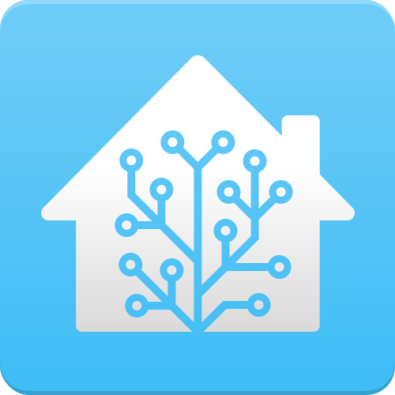

---
hide:
  - footer
  - feedback
  - actions
---
# Product directory

Explore guides and articles by product

<!-- HTML Tutorial: https://www.tutorialspoint.com/html/index.htm -->
<!-- Logos: https://logos.fandom.com/ -->

-  [Home Automation](homeautomation/index.md)
 | [HAOS on Hyper-V](homeautomation/haos/install-haos-on-hyperv.md) |

-  [PSAppDeployToolkit](psadt/index.md)
 | [Repository](https://github.com/docs-thetechguy-com/repository/tree/main/psadt) | [Training](psadt/training.md) | [Support](psadt/support.md) |

-  [Windows](windows/index.md)
 | [Windows on OPi5](windows/windows11-arm/windows11arm-on-opi5.md) |

