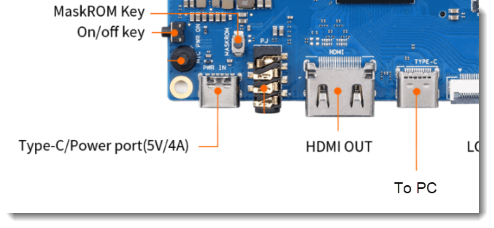
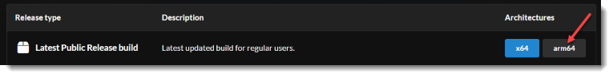
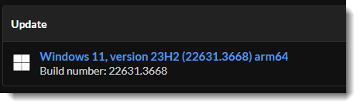

<div style="text-align: right"> last updated: {{ git_revision_date_localized }} </div>

# Windows 11 ARM on OPi5

This guide describes how to install the latest Windows 11 ARM image on an Orange Pi 5. Keep in mind this is still in development and individual results may vary.

<center>
<iframe width="560" height="315" src="https://www.youtube.com/embed/qpqhxOXO4D4?si=tOYdRPV1eDemUZvB" title="YouTube video player" frameborder="0" allow="accelerometer; autoplay; clipboard-write; encrypted-media; gyroscope; picture-in-picture; web-share" referrerpolicy="strict-origin-when-cross-origin" allowfullscreen></iframe>
</center>

## **Hardware Requirements**

<center></center>


- [Orange Pi 5 (OPi5)](http://www.orangepi.org/html/hardWare/computerAndMicrocontrollers/details/Orange-Pi-5.html)

	!!!note
		OPi5 supports ARMv8.2. Windows 11 requires ARMv8.1

		As of June 2024, Orange Pi 5 Pro is not supported by this project.

- [RGB fan and low-profile CPU radiator for Orange Pi 5](https://www.aliexpress.us/item/3256805285062643.html)

- [Black ball bearing fan - DC 5V sleeve dupont 40x40x10mm](https://www.aliexpress.us/item/3256807362230220.html)

- USB hub ([uni USB C to USB Hub 4 Ports](https://www.amazon.com/gp/product/B08P3GDLVP))

	!!!note  
		USB hub is requires as only the vertical USB-A ports will work for keyboard and mouse. Any USB hub may work, this is just want I had. 

- USB-C to USB-A adapter for hub

- NVMe drive (such as a [SABRENT 1TB Rocket NVMe PCIe M.2 2242](https://www.amazon.com/gp/product/B07XVTRFF8/ref=ppx_yo_dt_b_search_asin_title?ie=UTF8&th=1))

	!!!note
		Must be a NVMe M.2 drive. You may find some NVMe drives do not have driver support. I have found SABENT brand is supported.	

		There is no driver support for All M.2 SATA drives.

- [M.2 SSD screw set](https://www.amazon.com/gp/product/B086T2KXGQ)
- [Enclosure for M.2 PCIe NVMe](https://www.amazon.com/gp/product/B08RVC6F9Y)
- USB keyboard and mouse

## **Install UEFI firmware to SPI NOR flash**

[Reference Guide](https://wiki.radxa.com/Rock5/install/spi) (see Flash with Windows PC in section 4, option 2)

**Download**

- Download and extract v2.96 or later release of [RKDevTool](https://wiki.radxa.com/Rock5/install/rockchip-flash-tools)

- Download, extract, and install latest version of [Rockchip USB driver (RKDriverAssitant)](https://wiki.radxa.com/Rock5/install/rockchip-flash-tools)

- Download and extract v0.11.2 or later release image of [EDK2 UEFI firmware](https://github.com/edk2-porting/edk2-rk3588/releases) for orangepi-5_UEFI_Release_v#.##.#.img

	!!!note
		0.9.1 does not support built-in GMAC ethernet, use a newer build.

- Download v1.15.113 or later release of [SPL loader BIN file](https://dl.radxa.com/rock5/sw/images/loader/rock-5b/release)

**Write firmware**

- Open RKDevTool as an Administrator

- Right-click in a blank space and select Load Config

    - Select rock-5b-spinor.cfg
    - Click empty box under … to select file

		!!! note
			- Rk3588_spl_loader_v#.##.###.bin for Loader
    		- orangepi-5_UEFI_Release_v#.##.#.img for Image
    
    - Check Write by Address
    - Connect OPi5 from USB-C port to PC

- Hold down MARKROM button and connect USB-C power, wait a few seconds and release button

	

- Status in RKDevTool should change from "No Devices Found" to "Found One MASKROM Device"

- Click Run

- Process is done when "Download image OK" is displayed in the logging pane. 

	!!! note
		OPi5 will restarts by itself and exits MASKROM mode

- Disconnect from PC

## **Download Drivers**

Driver download posts are pinned in the #development discord channel

- Download RK3588 signed driver zip file (rk3588_drivers-v2.zip)
	- [Stable build](https://discord.com/channels/1082772881735438346/1082848823233216532/1236925998696763392)
	- [Release build (Downloads expire after 90 days)](https://github.com/worproject/Rockchip-Windows-Drivers/actions/workflows/build.yml?query=branch%3Amaster)

- Download updated storage driver (pdb, inf, and sys) to a folder named stornvme_storahci
	- [Release build](https://github.com/worproject/Rockchip-Windows-Drivers/tree/storportDriver/drivers/storage)

- Remove _ncc from file names (example rename stornvme_ncc.sys to stornvme.sys)

- Edit all inf files in notepad and remove _ncc from file names

- Add stornvme_storahci folder to rk3588_drivers-v2.zip file using 7-Zip

## **Download Windows 11 arm64 release package**

- Open [uupdump](https://uupdump.net)

- Option 1 (Windows 11 23H2 or earlier) - Imager method: From the menu, select Windows 11 > 23H2 > latest arm64 build.
- Option 2 (Windows 11 24H2 or later) - WinPE method: Click arm64 button, I typically choose the latest public release build
	
		

- Select latest Windows 11 update

	

- Choose language and click Next

- Uncheck Windows Home and click Next

- Select Download and convert to ISO

- Click Create download package

- Extract package to a folder that does not contain spaces in the path. Example: C:\ISO

- Extract rk3588_drivers-v2.zip to C:\ISO\Drivers\ALL

- Edit C:\ISO\ConvertConfig.ini with Notepad

	``` text
	AddUpdates   =1
	AddDrivers   =1
	```

## **Generate Windows ISO**

- Run `uup_download_windows.cmd`

- Wait for files to be downloaded, processed, and ISO generated. Takes ~60-minutes.

## **Option 1: Install Windows onto NVMe Drive using Imager**

- Download and extract v2.3.1 or later of the [imager](https://worproject.com/downloads#windows-on-raspberry-imager)

	!!!note
		Ignore that it says Raspberry. This was originally built for Raspberry Pi devices, but development has been extended to support Orange Pi devices)

- Plug the NVMe drive into your PC
- Run `WoR.exe` as an Administrator
	- Set wizard mode = Select show all options
	- Select storage device and device type = Raspberry Pi 2/3
	- Select ISO image and Windows Pro build
	- For drivers, select the downloaded rk3588_drivers-v2.zip file
	- For UEFI firmware, leave use the latest firmware. This doesn't really apply to OPi5.
	- Leave defaults for configuration
	- Click Install
	- Wait for the Windows offline install to complete. Takes ~5 minutes
	- Click Finish 

### **Windows Setup**

- Install NVMe drive into the bottom of your OPi5
- Power-on OPi5
- Wait for Windows to finish setup. Takes 30+ minutes.

	!!!note
		System may be slow while .NET Optimization runs 

- Complete the OOBE process

## **Option 2: Install Windows 11 24H2 or later using WinPE**

- Download and extract v1.1.0 or later of the [PE-based installer](https://worproject.com/downloads#windows-on-raspberry-pe-based-installer)

	!!!note
		Ignore that it says Raspberry. This was originally built for Raspberry Pi devices, but development has been extended to support Orange Pi devices)

- Plug a separate 16+ GB USB drive into your PC (This is for the installation media and not the NVMe drive)

- Download latest [rufus portable](https://rufus.ie/en/#download)

- Open Rufus as an Administrator, verify USB drive was detected, and drag ISO onto Rufus app

- Click Start

- Check both remove requirements and both disable options, then click OK

### **Update Drivers**

- Open command prompt as an Administrator and run:

	``` text
	md C:\ISO\Offline
	md C:\ISO\Offline_winre
	```
	``` text
	REM *** Replace stornvme.sys and storahci.sys in boot.wim index 2
	Dism /Mount-Image /ImageFile:D:\sources\boot.wim /Index:2 /mountDir:C:\ISO\Offline

	takeown /f C:\ISO\Offline\Windows\system32\drivers\stornvme.sys
	icacls C:\ISO\Offline\Windows\system32\drivers\stornvme.sys /grant %username%:F
	Ren C:\ISO\Offline\Windows\system32\drivers\stornvme.sys stornvme.sys.orig
	Copy C:\ISO\drivers\ALL\stornvme_storahci\stornvme.* C:\ISO\Offline\Windows\system32\drivers /Y

	takeown /f C:\ISO\Offline\Windows\system32\drivers\storahci.sys
	icacls C:\ISO\Offline\Windows\system32\drivers\storahci.sys /grant %username%:F
	Ren C:\ISO\Offline\Windows\system32\drivers\storahci.sys storahci.sys.orig
	Copy C:\ISO\drivers\ALL\stornvme_storahci\storahci.* C:\ISO\Offline\Windows\system32\drivers /Y

	Dism /Unmount-Image /mountDir:C:\ISO\Offline /Commit
	```
	``` text
	REM *** Replace stornvme.sys and storahci.sys in install.wim index 1 and winre.wim
	Dism /Mount-Image /ImageFile:D:\sources\install.wim /Index:1 /mountDir:C:\ISO\Offline

	takeown /f C:\ISO\Offline\Windows\system32\drivers\stornvme.sys
	icacls C:\ISO\Offline\Windows\system32\drivers\stornvme.sys /grant %username%:F
	Ren C:\ISO\Offline\Windows\system32\drivers\stornvme.sys stornvme.sys.orig
	Copy C:\ISO\drivers\ALL\stornvme_storahci\stornvme.* C:\ISO\Offline\Windows\system32\drivers /Y

	takeown /f C:\ISO\Offline\Windows\system32\drivers\storahci.sys
	icacls C:\ISO\Offline\Windows\system32\drivers\storahci.sys /grant %username%:F
	Ren C:\ISO\Offline\Windows\system32\drivers\storahci.sys storahci.sys.orig
	Copy C:\ISO\drivers\ALL\stornvme_storahci\storahci.* C:\ISO\Offline\Windows\system32\drivers /Y

	REM *** Replace stornvme.sys and storahci.sys in winre.wim
	Dism /Mount-Image /ImageFile:C:\ISO\Offline\windows\system32\recovery\winre.wim /Index:1 /mountDir:C:\ISO\Offline_winre
	Dism /Add-Driver /Image:C:\ISO\Offline_winre /Driver:C:\ISO\drivers\ALL /Recurse /ForceUnsigned
	Dism /Unmount-Image /mountDir:C:\ISO\Offline_winre /Commit

	Dism /Cleanup-Image /Image=C:\ISO\Offline /StartComponentCleanup /ResetBase /ScratchDir:C:\Windows\temp

	Dism /Unmount-Image /mountDir:C:\ISO\Offline /Commit
	```

---
- Set up the boot files
	```batch
	BCDboot P:\Windows /s P: /f UEFI
	```


- Copy UEFI firmware
	- Download v1.39 or later [UEFI firmware](https://github.com/pftf/RPi3/releases)

	- Extract `RPi3_UEFI_Firmware_v1.39.zip` to P:\

---

### **Windows Setup**

- Install USB drive into USB hub connected to the OPi5

- Power-on OPi5

- Press ESC to get the boot options

- Select Boot Manager > USB

- You should see the orange pi logo and after 30 seconds a Recovery screen will display

- Press F8 > 7 to disable driver signature enforcement

- Wait for WinPE to load

- Select Windows 11 and check I agree everything will be deleted

- Click I don't have a product key

- Delete all Disk 0 partitions

- Select Disk 0 Unallocated Space and click Next

- Summary: Install Windows 11 Pro, Keep nothing

- Click Install

- Wait for Windows to install, after restart you can remove the USB drive

- ***Currently this is not working and just hangs after restart***


## **Known Issues**

- When booting the loading circle locks up and Windows never loads. After a few power cycles it clears.

- BSOD when booting. This could be a sign that the storage driver (stornvme.sys) has been overwritten by Windows\Windows Update.

## **Thank you**

This guide wouldn't have been possible without Mario Bălănică, the developers, and the community that supports the Windows on R project.

- [Windows on R Project](https://worproject.com/)
- [Windows on R Community Discord](https://discord.gg/vjHwptUCa3)